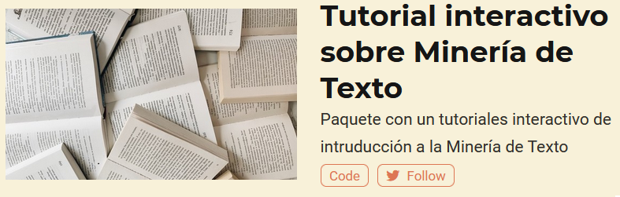

```{r setup, include=FALSE}
options(htmltools.dir.version = FALSE)
knitr::opts_chunk$set(
  fig.retina = 2,
  warning = FALSE,
  message = FALSE
)

library(fontawesome)
library(tidyverse)
```
class: inverse, middle, center


# `r rmarkdown::metadata$author` 

**Yanina Bellini Saibene**<br/>
_MetaDocencia - INTA_

[`r fa_i("twitter")` @yabellini](https://twitter.com/yabellini)<br/>
[`r fa_i("paper-plane")` yabellini@gmail.com](mailto:yabellini@gmail.com)<br>

???
Mi nombre es Yanina Bellini Saibene y les voy a presentar una serie de paquetes para utilizar en clases donde se usa R como lenguaje de programación.

---

.pull-left[

# Tutoriales interactivos

> Estos paquetes están basados en {learnr} y {learnres} que nos permiten generar tutoriales interactivos para enseñar algún aspecto de la programación en R.


] <!--end of pull left -->

.pull-right[


] <!--end of pull right -->
---

class: chapter-slide

# ¿Cómo los usamos en clases de grado y posgrado?

---


.left-column[
# Práctica durante la clase
] <!--end of left column -->

.right-column[

1. Enseñar tema nuevo con live coding.

1. Trabajo en grupos pequeños resolviendo el tutorial (15-25 minutos).  

1. Una persona comparte la pantalla y entre todos resuelven.  Pueden ir resolviendo en su máquina local también.

1. Volvemos a la sala común a compartir soluciones/dudas. Les estudiantes comparten pantalla para que todos veamos lo mismo.


] <!--end of right column -->

---

.left-column[
# Repaso de temas
] <!--end of left column -->

.right-column[

1. Materia nueva que necesita repasar un tema visto anteriormente.

1. Se puede trabajar en clase como el punto anterior.  

1. Otra alternativa: se envía como tarea previa a la clase. 

1. Se inicia la clase compartiendo soluciones/dudas. Les estudiantes comparten pantalla para que todos veamos lo mismo.


] <!--end of right column -->

---

.left-column[
# Guía de trabajos prácticos
] <!--end of left column -->

.right-column[

1. Los tutoriales interactivos son parte de las prácticas.

1. Se resuelven en casa _luego_ de la clase.  

1. Se inicia la próxima clase compartiendo soluciones/dudas. Les estudiantes comparten pantalla para que todos veamos lo mismo.


] <!--end of right column -->


---

# ¿Qué dicen los estudiantes?

Encuesta anónima, no obligatoria al final de cada clase preguntando lo que más y lo que menos les gustó. 

## Lo que más les gustó 

Estas son las respuestas relacionadas a los tutoriales

1. Alternar teoría-practica-ejemplos    __17%__
1. Materiales   __16%__
1. Ejercicios en grupo    __14%__
1. Practica interactiva/tutorial    __8%__

---
# ¿Qué dicen los estudiantes?

## Lo que cambiarían/lo que menos les gustó

Estas son las respuestas relacionadas a los tutoriales

1. Más tiempo para la práctica __26%__
1. Más practica __24%__
1. Problemas de instalación __18%__


---

class: chapter-slide

# ¿Qué tutoriales hay disponibles ?

---

## Visualización


<br/> Introduce la gramática de los gráficos y como se implementa en {ggplot2}.  

Uso: como práctica luego de introducir el tema y como repaso.

Es uno de los paquete que se usa para auto aprendizaje (fuera de la materia).
---

## Trabajo con texto 


---

## Iteración


---

class: chapter-slide

# ¿Dónde busco más información?
